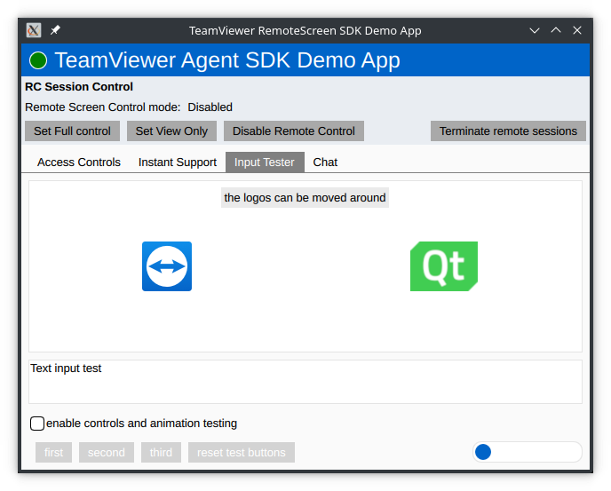

# Qt API example app

### Plugin

Functionality at a glance:

* register and unregister an application window for remote control
* enabling/disabling remote control
* stop all running TeamViewer sessions with remote control
* get notified when a TeamViewer session with remote control has been started or stopped
* get notified when communication with the TeamViewer IoT Agent is established or lost
* exchange chat messages
* request Instant Support
* set and retrieve access permissions to various IoT Agent features

You can find more details and an API documentation in Interface.h [TVQtRC/Library/export/TVQtRC/Interface.h](./TVQtRC/Library/export/TVQtRC/Interface.h) contained in the package.

#### Make the public API available for the existing Qt application

Example of how to integrate the installed plugin using CMake (see [Installation for Development](#installation-for-development)):

```cmake
cmake_minimum_required(VERSION 3.10)

project(YourOwnQtApp)

set(CMAKE_POSITION_INDEPENDENT_CODE ON)
set(CMAKE_CXX_STANDARD 14)

set(CMAKE_INCLUDE_CURRENT_DIR ON)
set(CMAKE_AUTOMOC ON)
set(CMAKE_AUTORCC ON)

# announce package location
set(TVAgentSDK_DIR "<install prefix>/lib/cmake/TVAgentSDK")

# find the package itself
find_package(TVAgentSDK 2.0 REQUIRED)

# other, dependent packages
find_package(Qt5 COMPONENTS Core Gui Widgets REQUIRED)

add_executable(yourOwnApp "main.cpp")
target_link_libraries(yourOwnApp
    PRIVATE
        TVAgentSDK::TVQtRC.interface # link only against the plugin interface, not the plugin itself
        Qt5::Core
        Qt5::Gui
        Qt5::Widgets
)
```

#### Load the plugin using QPluginLoader and register the application window:

```cpp
#include <TVQtRC/Interface.h>

#include <QApplication>
#include <QPushButton>
#include <QPluginLoader>

int main( int argc, char **argv )
{
    QApplication app( argc, argv );

    QPushButton hello( "Hello world!", 0 );
    hello.resize( 100, 30 );

    hello.show();

    // load plugin, register window to be remote controlled  and enable full control

    tvqtsdk::TVQtRCPluginInterface* plugin = nullptr;

    QPluginLoader loader("<path to plugin libTVQtRC.so>");

    QObject* instance = loader.instance();

    if ((plugin = qobject_cast<tvqtsdk::TVQtRCPluginInterface*>(instance)))
    {
        plugin->registerApplicationWindow(hello.windowHandle());

        plugin->setControlMode(tvqtsdk::ControlMode::FullControl);
    }

    return app.exec();
}
...
```

#### The Agent may be executing on a custom path... its sockets will be there, too

If the Agent's configuration specifies a base URL such as `unix:///foo/bar/etc` (e.g., **global.conf** contains `[strng] RemoteScreenSdkBaseUrl = "unix:///foo/bar/etc"`), its sockets will be created in the directory `/foo/bar/etc`. The SDK will then need to know where to find the sockets. For this purpose, the same base URL must be provided to the SDK as well:

```cpp
if ((plugin = qobject_cast<TVQtRCPluginInterface*>(instance)))
{
    plugin->setRemoteScreenSdkBaseUrl("unix:///foo/bar/etc");
    ...
}

...
```
The length of this base URL should not exceed the size of 60 characters. Otherwise the Agent or SDK is not able to create the necessary sockets.

Note: The SDK also creates its own sockets; after this call, those sockets will be created under `/foo/bar/etc`, too. This is done for customers who wish for the entire TeamViewer functionality to be confined within one single directory.

### Example Application

The provided Qt application is an example implementation for how to use the Agent SDK. You will need to have a running TeamViewer IoT Agent for making use of the sample application. The application provides the Remote Screen App Interface, which is used by the provided plugin (Agent SDK). The customer application uses the Agent SDK to manage the control mode and also the sessions. The TeamViewer IoT Agent forwards this data using the secure TeamViewer network to the TeamViewer client. The TeamViewer client on the supporter's device visualizes the received data in a TeamViewer window and sends the captured input data back to the TeamViewer IoT Agent and consequently to the example application.



The example application requires as a minimum Qt 5.3 with the Qt Quick 2.3 and Qt Quick Window 2.0 modules to run.

On Debian-based distributions, the following packages are required:

* `qml-module-qtquick2`
* `qml-module-qtquick-window2`

With the example application you can also test and see all basic operations:

* Connectivity to the Agent: the circle on the top left corner is green when the IoT Agent is available (this does NOT indicate network connectivity)
* Set the control mode: "Set Full Control" (image updates and input), "Set View Only" (image updates, no input), "Disable Remote Control" (no image updates, no input)
* Clicking the "Terminate remote sessions" button terminates all incoming sessions, after which the button becomes disabled.
* Mouse and keyboard input testing

## Known Bugs

Please contact TeamViewer support ⟨support@teamviewer.com⟩ if you encounter bugs.

### Inverted Colors

On some ARM based devices, the colors may seem inverted or appear wrong on the client's side.

### Screen Refresh

When the RemoteScreenChannels setting is configured with EAP:FBPush, it may happen that the client picture is sometimes not refreshed appropriately during a TeamViewer session. Resizing the window will force an update and will display the actual content of the application in the client window.

For more information about the different channel configurations and their use, please visit https://www.teamviewer.com/link/?url=710439
